# Health-APP-user-research-report
健康APP用户研究报告（完整版）
## 项目背景
我们通过数字图像和仪表盘两种健康APP来进行项目研究，在这个大多数人处于亚健康的社会群体里，人们都会习惯使用各种健康APP来查看自己的身体状况，生活的快节奏让人们越来越依赖APP的数据，因此对于APP的观感、体验对于APP制作方就十分重要，所以我们希望通过对两个APP部分用户的调查与分析来改善两个APP的现状，使它们更加人性化，更直观舒服的反映用户的健康情况。
## 用户研究方法描述
我们的研究方法有采访调查，制作鱼骨图分析，制作亲和图和Excel编码分析
首先是在线下与APP用户进行1对1的访谈，分别从四个方面，首页、分享、我的好友、更换形象用户的情感指标进行采访调查，从而得知用户对APP各个方面的情绪。
其次是制作了鱼骨图，将用户对两个APP的情感指标用图片生动形象的表现出来，并分析其产生情绪的原因，并寻求将积极情绪延续，消极情绪消除的方法。
然后我们制作了彩虹图，更清楚明白的看到不同性别用户侧重不同的方面评价，同时制作了亲和图来分类不同功能侧重的评论。
## 定性研究分析和编码方法
#### 定性资料归类
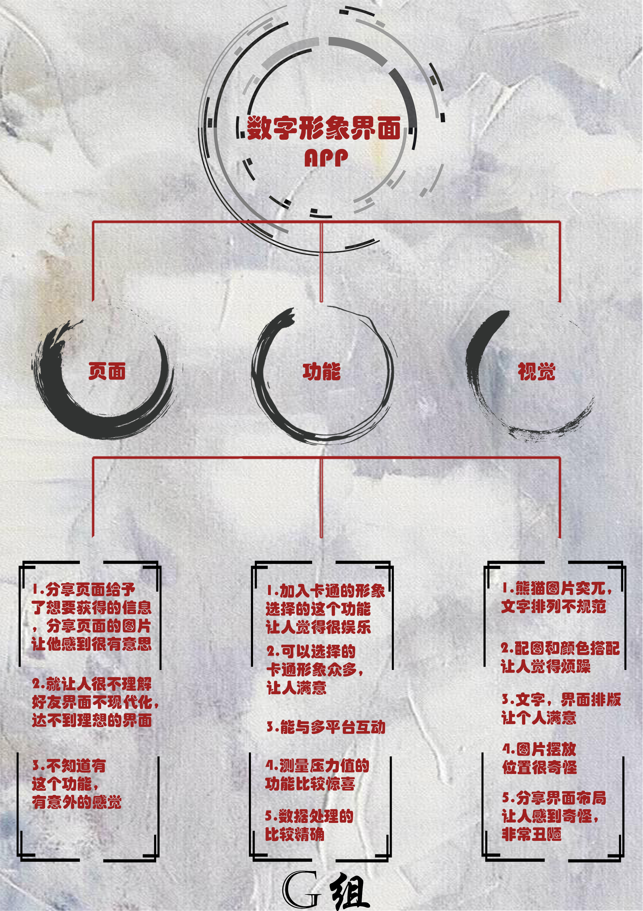 
#### Excel编码
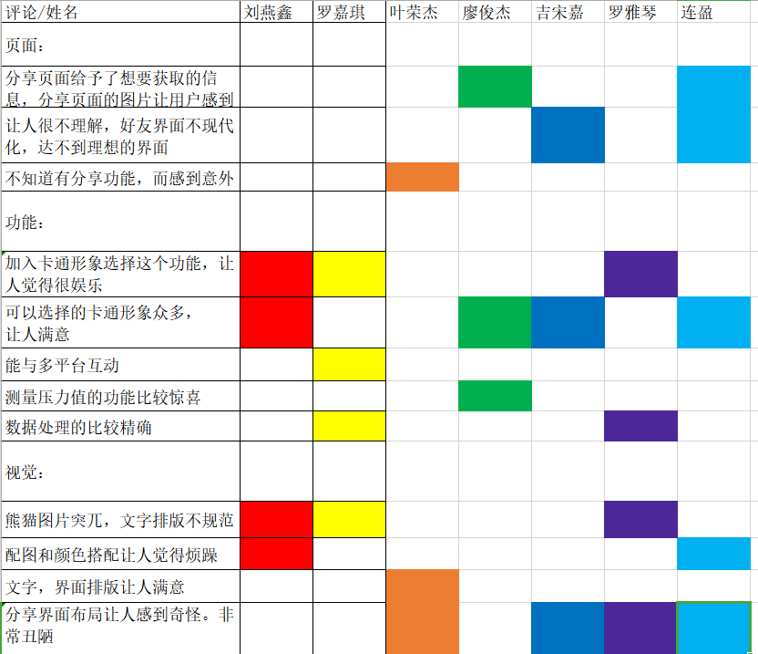 

#### 定性资料归类
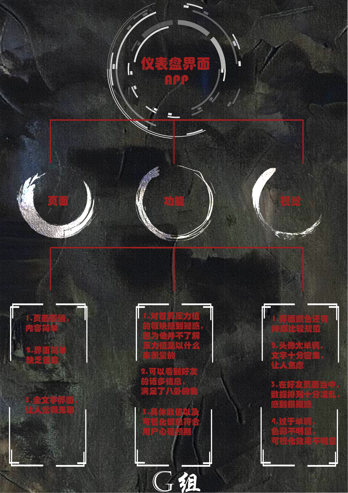 
#### Excel编码
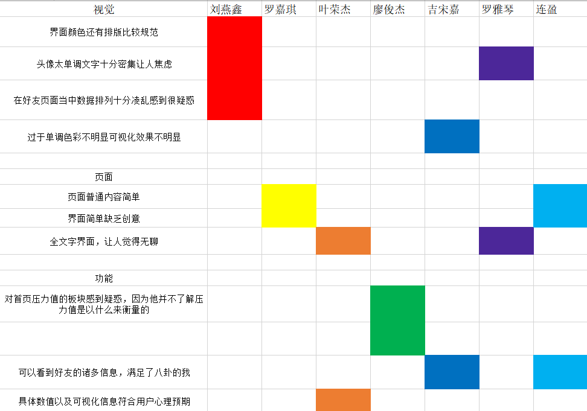 
- 亲和图

经过调查结果后制作各种对比图和数据后，我们得出下面一些结论。
我们为两个APP的用户反馈结果都制作了亲和图，对于数字图像APP的页面，用户感到意外和有意思，对信息和图片的反馈表示赞同，但也有一部分人认为不够现代化。对于数字图像APP的功能，总体让用户感到十分满意，各方面功能都能达到需求。而视觉方面，用户认为做的很不好，排版突兀，搭配奇怪，需要改进。
对于仪表盘APP的页面，用户体验不好，总体太过无聊需要改进。对于功能方面，用户认为达到预期，但是如果可以加入一些注释会更舒服。对于视觉方面，太过单调，可以色彩搭配更明显一些，文字也太过密集。

- 彩虹图

我们同时通过彩虹图对不同性别的人群进行了分析，关于数字图像，男女生的意见十分统一，对于页面都没有很大需求，而十分在意功能和视觉方面。因此我们可以知道一个APP的功能和视觉都是吸引用户的关键！
关于仪表盘，男生对视觉方面没什么需求，其他两个方面都比较在意，而女生则是三个方面都很在意。所以我们可以知道，在动画图像少的APP，用户就会觉得视觉方面没什么在意，也不好吸引用户。
## 卡片设计
- [鱼骨图设计](http://naotu.baidu.com/file/b2a12c2257beedcf25f16f0b46a2d50f)
- 以下为鱼骨图的卡片设计： 

 
 
 
 
 
 
 
 
 
 
 
 

## 重点功能的感情指标 统计与分析
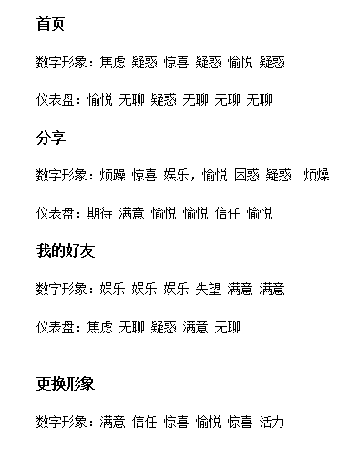 
## 数字形象界面的总体 情感指标 统计分析
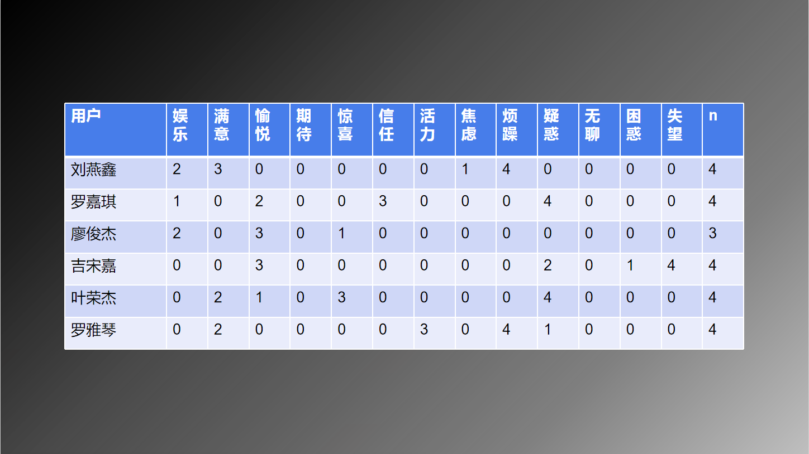 
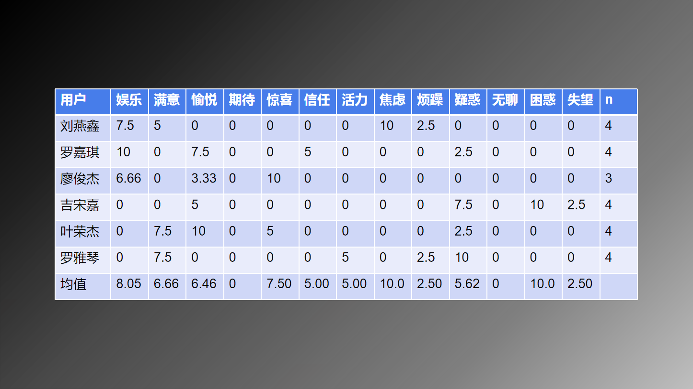 
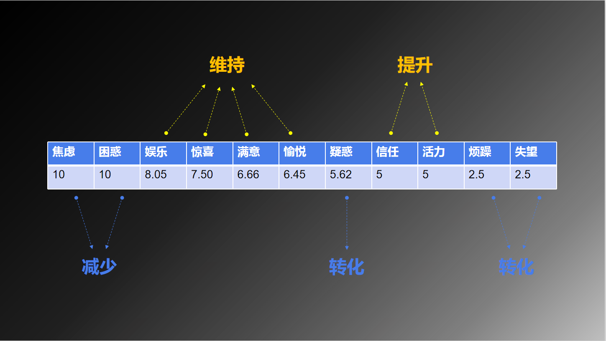 
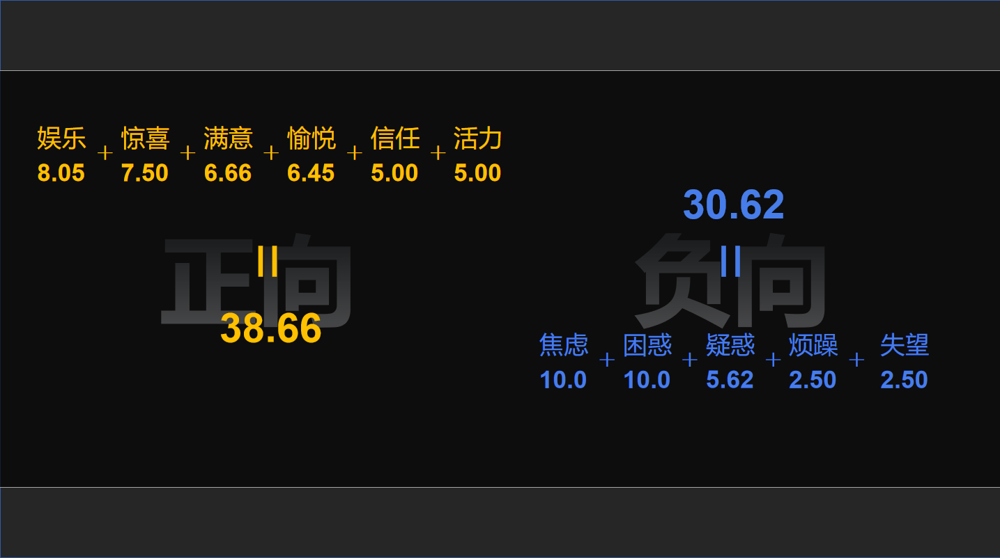 
## 仪表盘界面的总体 情感指标 统计与分析
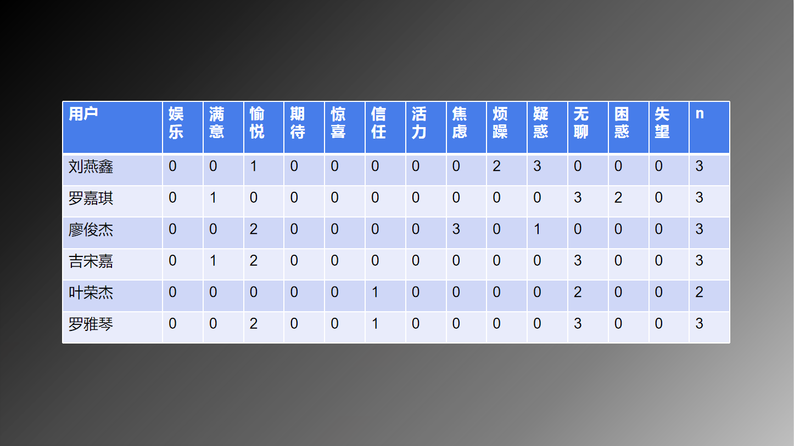 
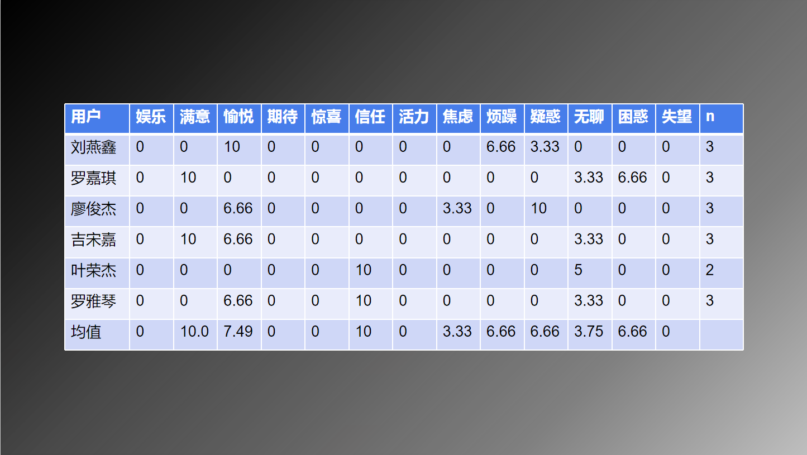 
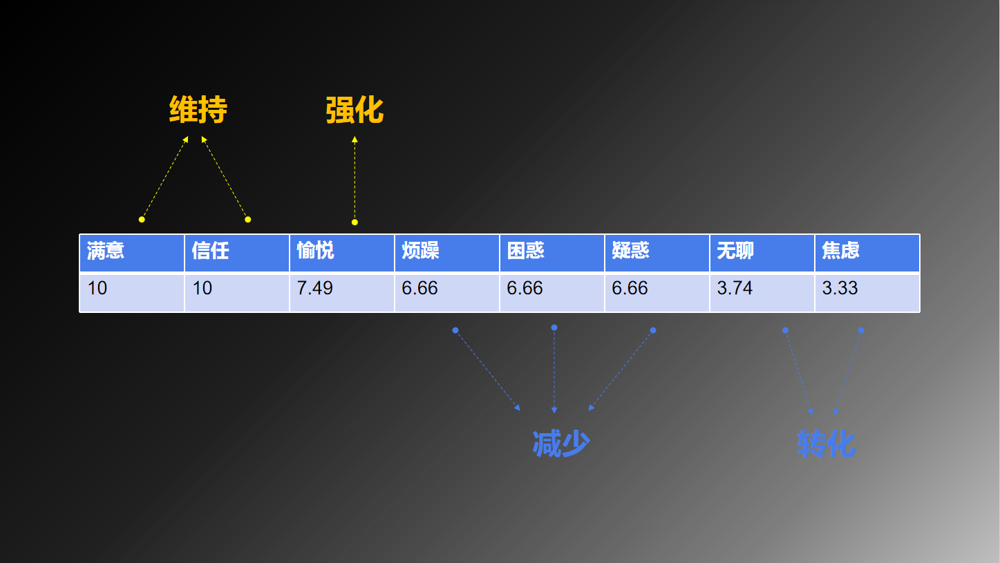 
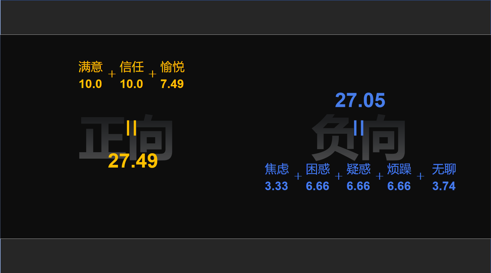 
